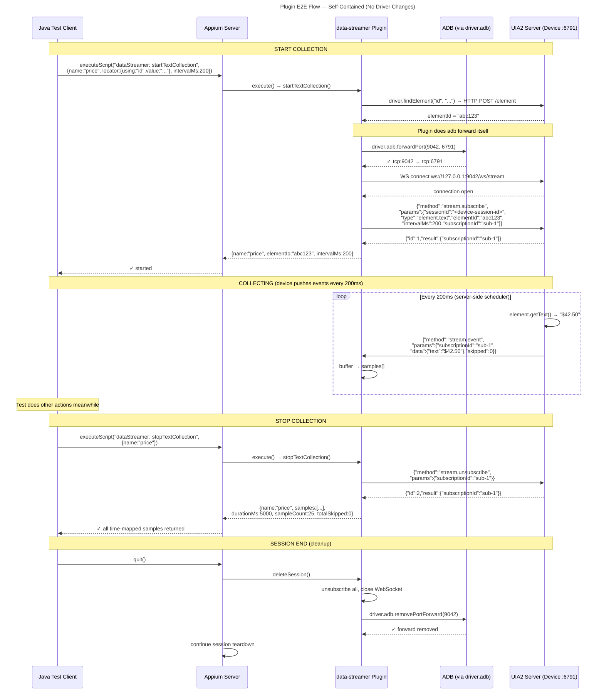

```mermaid
---
title: "Plugin E2E Flow — Self-Contained (No Driver Changes)"
---
sequenceDiagram
    participant Test as Java Test Client
    participant Appium as Appium Server
    participant Plugin as data-streamer Plugin
    participant ADB as ADB (via driver.adb)
    participant Device as UIA2 Server (Device :6791)

    Note over Test,Device: START COLLECTION

    Test->>Appium: executeScript("dataStreamer: startTextCollection",<br/>{name:"price", locator:{using:"id",value:"..."}, intervalMs:200})
    Appium->>Plugin: execute() → startTextCollection()

    Plugin->>Device: driver.findElement("id", "...") → HTTP POST /element
    Device-->>Plugin: elementId = "abc123"

    Note over Plugin,Device: Plugin does adb forward itself

    Plugin->>ADB: driver.adb.forwardPort(9042, 6791)
    ADB-->>Plugin: ✓ tcp:9042 → tcp:6791

    Plugin->>Device: WS connect ws://127.0.0.1:9042/ws/stream
    Device-->>Plugin: connection open

    Plugin->>Device: {"method":"stream.subscribe",<br/>"params":{"sessionId":"<device-session-id>",<br/>"type":"element.text","elementId":"abc123",<br/>"intervalMs":200,"subscriptionId":"sub-1"}}
    Device-->>Plugin: {"id":1,"result":{"subscriptionId":"sub-1"}}

    Plugin-->>Appium: {name:"price", elementId:"abc123", intervalMs:200}
    Appium-->>Test: ✓ started

    Note over Test,Device: COLLECTING (device pushes events every 200ms)

    loop Every 200ms (server-side scheduler)
        Device->>Device: element.getText() → "$42.50"
        Device->>Plugin: {"method":"stream.event",<br/>"params":{"subscriptionId":"sub-1",<br/>"data":{"text":"$42.50"},"skipped":0}}
        Plugin->>Plugin: buffer → samples[]
    end

    Note over Test: Test does other actions meanwhile

    Note over Test,Device: STOP COLLECTION

    Test->>Appium: executeScript("dataStreamer: stopTextCollection",<br/>{name:"price"})
    Appium->>Plugin: execute() → stopTextCollection()

    Plugin->>Device: {"method":"stream.unsubscribe",<br/>"params":{"subscriptionId":"sub-1"}}
    Device-->>Plugin: {"id":2,"result":{"subscriptionId":"sub-1"}}

    Plugin-->>Appium: {name:"price", samples:[...],<br/>durationMs:5000, sampleCount:25, totalSkipped:0}
    Appium-->>Test: ✓ all time-mapped samples returned

    Note over Test,Device: SESSION END (cleanup)

    Test->>Appium: quit()
    Appium->>Plugin: deleteSession()
    Plugin->>Plugin: unsubscribe all, close WebSocket
    Plugin->>ADB: driver.adb.removePortForward(9042)
    ADB-->>Plugin: ✓ forward removed
    Appium->>Appium: continue session teardown
```
