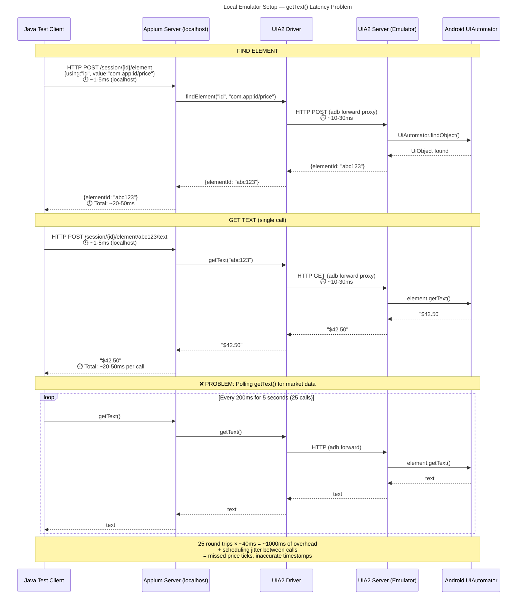

```mermaid
---
title: "Local Emulator Setup — getText() Latency Problem"
---
sequenceDiagram
    participant Client as Java Test Client
    participant Appium as Appium Server (localhost)
    participant Driver as UIA2 Driver
    participant Device as UIA2 Server (Emulator)
    participant Android as Android UIAutomator

    Note over Client,Android: FIND ELEMENT

    Client->>Appium: HTTP POST /session/{id}/element<br/>{using:"id", value:"com.app:id/price"}<br/>⏱️ ~1-5ms (localhost)
    Appium->>Driver: findElement("id", "com.app:id/price")
    Driver->>Device: HTTP POST (adb forward proxy)<br/>⏱️ ~10-30ms
    Device->>Android: UiAutomator.findObject()
    Android-->>Device: UiObject found
    Device-->>Driver: {elementId: "abc123"}
    Driver-->>Appium: {elementId: "abc123"}
    Appium-->>Client: {elementId: "abc123"}<br/>⏱️ Total: ~20-50ms

    Note over Client,Android: GET TEXT (single call)

    Client->>Appium: HTTP POST /session/{id}/element/abc123/text<br/>⏱️ ~1-5ms (localhost)
    Appium->>Driver: getText("abc123")
    Driver->>Device: HTTP GET (adb forward proxy)<br/>⏱️ ~10-30ms
    Device->>Android: element.getText()
    Android-->>Device: "$42.50"
    Device-->>Driver: "$42.50"
    Driver-->>Appium: "$42.50"
    Appium-->>Client: "$42.50"<br/>⏱️ Total: ~20-50ms per call

    Note over Client,Android: ❌ PROBLEM: Polling getText() for market data

    loop Every 200ms for 5 seconds (25 calls)
        Client->>Appium: getText()
        Appium->>Driver: getText()
        Driver->>Device: HTTP (adb forward)
        Device->>Android: element.getText()
        Android-->>Device: text
        Device-->>Driver: text
        Driver-->>Appium: text
        Appium-->>Client: text
    end

    Note over Client,Android: 25 round trips × ~40ms = ~1000ms of overhead<br/>+ scheduling jitter between calls<br/>= missed price ticks, inaccurate timestamps
```
