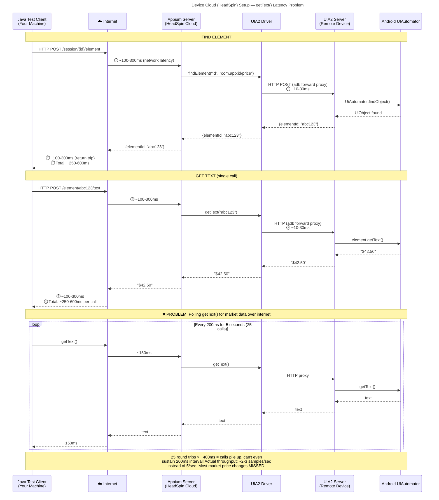

```mermaid
---
title: "Device Cloud (HeadSpin) Setup — getText() Latency Problem"
---
sequenceDiagram
    participant Client as Java Test Client<br/>(Your Machine)
    participant Internet as ☁️ Internet
    participant Appium as Appium Server<br/>(HeadSpin Cloud)
    participant Driver as UIA2 Driver
    participant Device as UIA2 Server<br/>(Remote Device)
    participant Android as Android UIAutomator

    Note over Client,Android: FIND ELEMENT

    Client->>Internet: HTTP POST /session/{id}/element
    Internet->>Appium: ⏱️ ~100-300ms (network latency)
    Appium->>Driver: findElement("id", "com.app:id/price")
    Driver->>Device: HTTP POST (adb forward proxy)<br/>⏱️ ~10-30ms
    Device->>Android: UiAutomator.findObject()
    Android-->>Device: UiObject found
    Device-->>Driver: {elementId: "abc123"}
    Driver-->>Appium: {elementId: "abc123"}
    Appium-->>Internet: {elementId: "abc123"}
    Internet-->>Client: ⏱️ ~100-300ms (return trip)<br/>⏱️ Total: ~250-600ms

    Note over Client,Android: GET TEXT (single call)

    Client->>Internet: HTTP POST /element/abc123/text
    Internet->>Appium: ⏱️ ~100-300ms
    Appium->>Driver: getText("abc123")
    Driver->>Device: HTTP (adb forward proxy)<br/>⏱️ ~10-30ms
    Device->>Android: element.getText()
    Android-->>Device: "$42.50"
    Device-->>Driver: "$42.50"
    Driver-->>Appium: "$42.50"
    Appium-->>Internet: "$42.50"
    Internet-->>Client: ⏱️ ~100-300ms<br/>⏱️ Total: ~250-600ms per call

    Note over Client,Android: ❌ PROBLEM: Polling getText() for market data over internet

    loop Every 200ms for 5 seconds (25 calls)
        Client->>Internet: getText()
        Internet->>Appium: ~150ms
        Appium->>Driver: getText()
        Driver->>Device: HTTP proxy
        Device->>Android: getText()
        Android-->>Device: text
        Device-->>Driver: text
        Driver-->>Appium: text
        Appium-->>Internet: text
        Internet-->>Client: ~150ms
    end

    Note over Client,Android: 25 round trips × ~400ms = calls pile up, can't even<br/>sustain 200ms interval! Actual throughput: ~2-3 samples/sec<br/>instead of 5/sec. Most market price changes MISSED.
```
